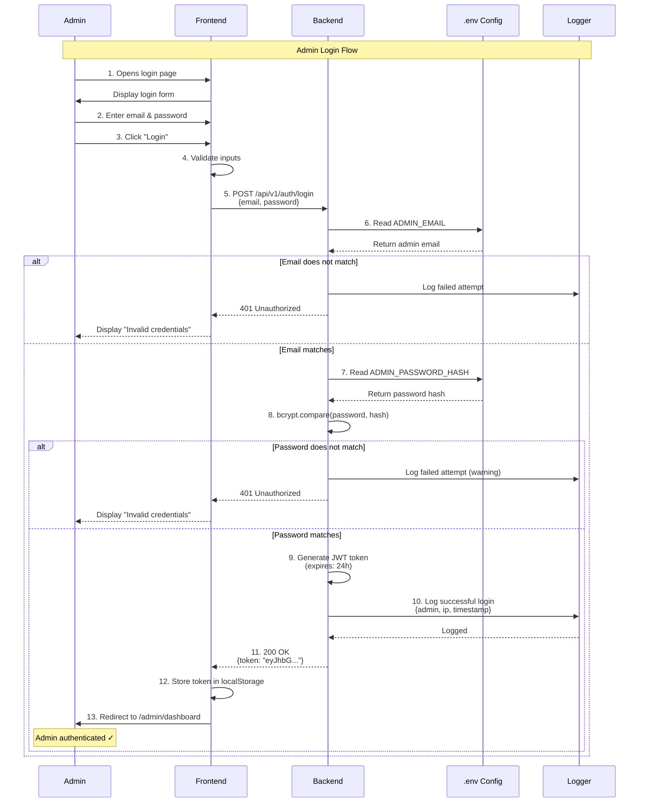

# Use Case: Admin Login

## Use Case ID

`UC-001`

## Use Case Name

Admin Authentication and Login

## Description

This use case describes the process by which an administrator authenticates themselves to access the admin dashboard of the Enterprise Request Management System. Authentication is performed using email and password credentials stored in environment variables, and upon successful validation, a JWT token is issued.

---

## Actors

### Primary Actor

- **Admin** - System administrator who manages user types, requests, and system configuration

### Secondary Actors

- **Backend System** - Node.js/Express server handling authentication logic
- **Environment Configuration** - `.env` file storing admin credentials

---

## Preconditions

1. Admin must have valid credentials (email and password)
2. Admin credentials must be configured in `.env` file:
   - `ADMIN_EMAIL` is set
   - `ADMIN_PASSWORD_HASH` is set (bcrypt hashed password)
3. Backend server is running and accessible
4. Database connection is active
5. JWT secret is configured in environment variables

---

## Postconditions

### Success Postconditions

1. Admin is authenticated successfully
2. JWT token is generated and returned to the client
3. Admin session is logged in the system logs
4. Admin is redirected to the dashboard
5. Token is stored in browser's localStorage

### Failure Postconditions

1. Admin is not authenticated
2. Error message is displayed
3. Failed login attempt is logged
4. Admin remains on the login page

---

## Main Flow (Happy Path)

| Step | Actor | Action | System Response |
|------|-------|--------|-----------------|
| 1 | Admin | Opens the admin login page | Frontend displays login form with email and password fields |
| 2 | Admin | Enters email address | Frontend validates email format |
| 3 | Admin | Enters password | Frontend masks password input |
| 4 | Admin | Clicks "Login" button | Frontend validates that both fields are filled |
| 5 | Frontend | Sends POST request to `/api/v1/auth/login` with credentials | - |
| 6 | Backend | Receives login request | Extracts email and password from request body |
| 7 | Backend | Compares email with `ADMIN_EMAIL` from `.env` | Checks if email matches |
| 8 | Backend | Compares password hash with `ADMIN_PASSWORD_HASH` | Uses bcrypt.compare() to verify password |
| 9 | Backend | Generates JWT token (expires in 24h) | Token includes admin identifier and expiration |
| 10 | Backend | Logs successful login with IP address | Writes to `logs/combined.log` |
| 11 | Backend | Returns success response with token | `{ success: true, token: "eyJhbG..." }` |
| 12 | Frontend | Receives token | Stores token in localStorage |
| 13 | Frontend | Redirects admin to dashboard | Navigates to `/admin/dashboard` |
| 14 | Admin | Views admin dashboard | Dashboard loads with navigation menu |

---

## Alternative Flows

### Alternative Flow 1: Invalid Email

**Trigger:** Email does not match `ADMIN_EMAIL` (Step 7)

| Step | Actor | Action | System Response |
|------|-------|--------|-----------------|
| 7a | Backend | Email mismatch detected | Returns 401 Unauthorized error |
| 7b | Backend | Logs failed login attempt | Records email and IP address in logs |
| 7c | Frontend | Receives error response | Displays "Invalid email or password" message |
| 7d | Admin | Sees error message | Remains on login page |

**Resume:** Admin can try again from Step 2

### Alternative Flow 2: Invalid Password

**Trigger:** Password hash does not match `ADMIN_PASSWORD_HASH` (Step 8)

| Step | Actor | Action | System Response |
|------|-------|--------|-----------------|
| 8a | Backend | Password mismatch detected | Returns 401 Unauthorized error |
| 8b | Backend | Logs failed login attempt | Records email and IP in `logs/combined.log` with warning level |
| 8c | Frontend | Receives error response | Displays "Invalid email or password" message |
| 8d | Admin | Sees error message | Remains on login page |

**Resume:** Admin can try again from Step 2

### Alternative Flow 3: Empty Fields

**Trigger:** Admin submits form with empty fields (Step 4)

| Step | Actor | Action | System Response |
|------|-------|--------|-----------------|
| 4a | Frontend | Validates form fields | Detects empty email or password |
| 4b | Frontend | Displays validation error | Shows "Email and password are required" |
| 4c | Admin | Sees validation message | Fields are highlighted in red |

**Resume:** Admin fills in fields from Step 2

### Alternative Flow 4: Invalid Email Format

**Trigger:** Admin enters invalid email format (Step 2)

| Step | Actor | Action | System Response |
|------|-------|--------|-----------------|
| 2a | Frontend | Validates email format | Detects invalid format (e.g., "admin@") |
| 2b | Frontend | Displays format error | Shows "Please enter a valid email address" |
| 2c | Admin | Sees validation message | Email field is highlighted |

**Resume:** Admin corrects email from Step 2

### Alternative Flow 5: Server Error

**Trigger:** Backend error during authentication (any backend step)

| Step | Actor | Action | System Response |
|------|-------|--------|-----------------|
| *a | Backend | Encounters internal error | Catches exception |
| *b | Backend | Logs error with stack trace | Writes to `logs/error.log` |
| *c | Backend | Returns 500 Internal Server Error | `{ error: "An error occurred during login" }` |
| *d | Frontend | Receives error response | Displays "Server error. Please try again later." |

**Resume:** Admin can try again from Step 2

### Alternative Flow 6: Network Failure

**Trigger:** Network request fails (Step 5)

| Step | Actor | Action | System Response |
|------|-------|--------|-----------------|
| 5a | Frontend | Network request fails | Catches network error |
| 5b | Frontend | Displays connection error | Shows "Unable to connect to server" |
| 5c | Admin | Sees error message | Can retry when connection is restored |

**Resume:** Admin can try again from Step 2

---

## Exception Flows

### Exception 1: Token Generation Failure

**Trigger:** JWT library fails to generate token (Step 9)

| Step | Actor | Action | System Response |
|------|-------|--------|-----------------|
| 9a | Backend | JWT generation fails | Throws error |
| 9b | Backend | Logs error | Records in error log with stack trace |
| 9c | Backend | Returns 500 error | "Authentication failed" message |

**Result:** Login fails, admin must retry

### Exception 2: Environment Variables Not Set

**Trigger:** `.env` file missing required variables

| Step | Actor | Action | System Response |
|------|-------|--------|-----------------|
| - | Backend | Server starts | Detects missing ADMIN_EMAIL or ADMIN_PASSWORD_HASH |
| - | Backend | Logs critical error | Server may fail to start or disable login |

**Result:** System administrator must configure environment variables

---

## Sequence Diagram



---

## Business Rules

### BR-001: Single Admin Account

- The system supports only one admin account configured via environment variables
- No database table for admin users is required

### BR-002: Password Security

- Admin password must be stored as bcrypt hash in `.env`
- Minimum password strength: 8 characters (enforced during setup)
- Password is never logged or returned in responses

### BR-003: Token Expiration

- JWT tokens expire after 24 hours
- Expired tokens require re-authentication
- No refresh token mechanism (admin must login again)

### BR-004: Login Attempts

- No rate limiting implemented in basic version
- Failed attempts are logged but account is not locked
- Consider implementing rate limiting in production

### BR-005: Session Management

- Token is stored in browser's localStorage
- Logout clears the token from localStorage
- No server-side session storage

---

## Technical Requirements

### API Endpoint

```
POST /api/v1/auth/login
```

### Request Format

```json
{
  "email": "admin@site.com",
  "password": "adminPassword123"
}
```

### Success Response (200 OK)

```json
{
  "success": true,
  "token": "eyJhbGciOiJIUzI1NiIsInR5cCI6IkpXVCJ9...",
  "expiresIn": "24h"
}
```

### Error Response (401 Unauthorized)

```json
{
  "success": false,
  "error": "Invalid email or password"
}
```

### Error Response (500 Internal Server Error)

```json
{
  "success": false,
  "error": "An error occurred during authentication"
}
```

---

## Security Considerations

1. **Password Hashing**: Always use bcrypt with salt rounds ≥ 10
2. **HTTPS Required**: Login endpoint must be accessed over HTTPS in production
3. **CORS Configuration**: Restrict origins to trusted frontend domains
4. **Token Security**:
   - Use strong JWT secret (minimum 256 bits)
   - Include expiration time in token payload
   - Consider using HttpOnly cookies instead of localStorage for enhanced security
5. **Error Messages**: Never reveal whether email or password was incorrect (use generic message)
6. **Logging**:
   - Log all authentication attempts (success and failure)
   - Include IP address and timestamp
   - Never log passwords or tokens

---

## Logging Requirements

### Successful Login

```
[2026-02-17 14:30:00] [info] Admin login successful 
{"admin":"admin@site.com","ip":"192.168.1.100"}
```

### Failed Login

```
[2026-02-17 14:35:15] [warn] Failed login attempt 
{"email":"wrong@mail.com","ip":"192.168.1.150"}
```

### System Error

```
[2026-02-17 14:40:22] [error] Error during authentication 
{"error":"JWT secret not configured","stack":"..."}
```

---

## UI/UX Requirements

1. **Login Form**:
   - Clean, professional design
   - Email field with type="email"
   - Password field with type="password" and show/hide toggle
   - "Remember me" checkbox (optional)
   - Submit button clearly labeled "Login"

2. **Loading State**:
   - Disable submit button during authentication
   - Show loading spinner or text "Logging in..."

3. **Error Display**:
   - Show error messages above the form
   - Use red color for error messages
   - Auto-dismiss after 5 seconds or on next input

4. **Success State**:
   - Brief success message (optional)
   - Smooth transition to dashboard

---

## Testing Checklist

- [ ] Valid credentials result in successful login
- [ ] Invalid email returns 401 error
- [ ] Invalid password returns 401 error
- [ ] Empty email field shows validation error
- [ ] Empty password field shows validation error
- [ ] Invalid email format shows validation error
- [ ] JWT token is generated correctly
- [ ] Token expiration is set to 24 hours
- [ ] Token is stored in localStorage
- [ ] Successful login is logged
- [ ] Failed login is logged with warning level
- [ ] Admin is redirected to dashboard after login
- [ ] Error handling for network failures
- [ ] Error handling for server errors
- [ ] Password is never exposed in logs or responses

---

## Related Use Cases

- **UC-002**: Admin Logout
- **UC-003**: Admin View Requests
- **UC-004**: Admin Approve/Reject Request
- **UC-005**: Admin Create User Type

---

## References

- [mindset.txt](file:///c:/Users/m7asa/GitHub/enterpriseCamp/mindset.txt) - Lines 262-294 (FLOW 2: ADMIN LOGIN)
- API Endpoint: `/api/v1/auth/login` (Lines 91-92)
- Logging Requirements: Lines 669, 675

---

**Document Version:** 1.0  
**Last Updated:** 2026-02-17  
**Author:** System Analyst  
**Status:** Draft
